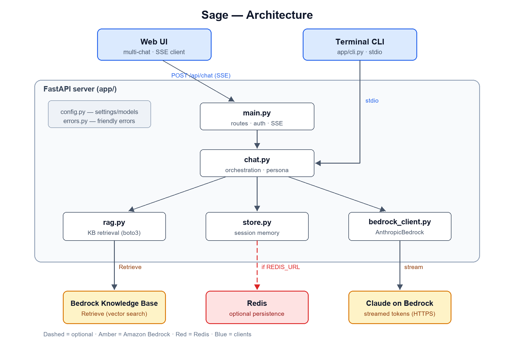
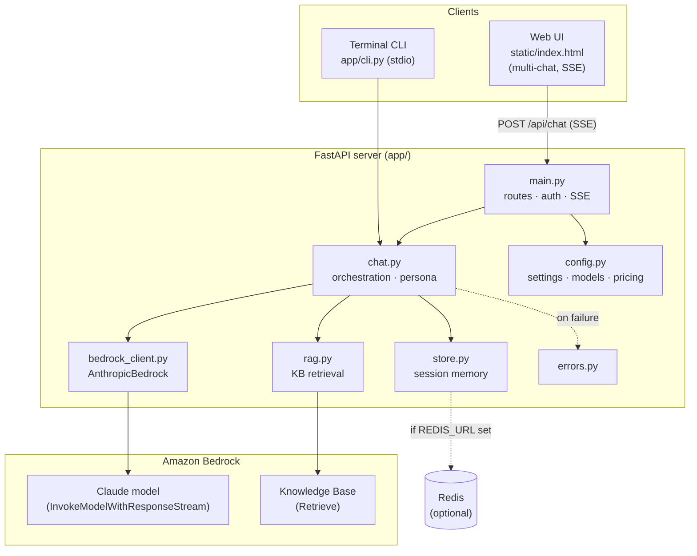
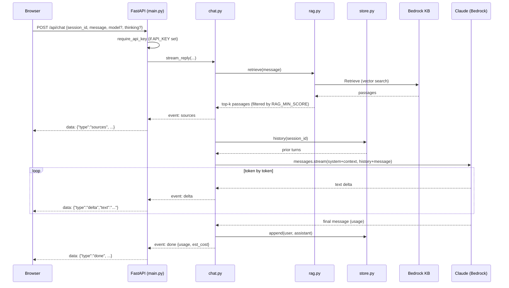
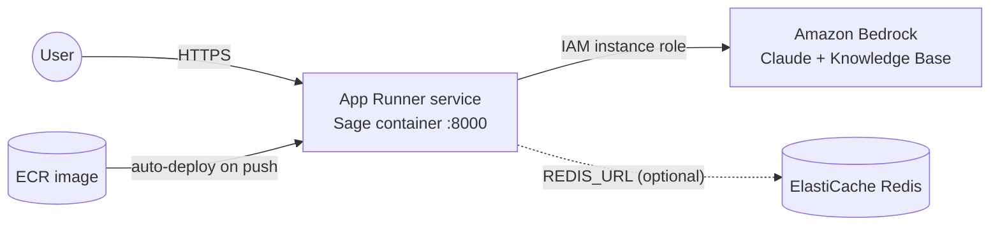

# Sage Architecture

Sage is a Bedrock + Claude chatbot with optional retrieval-augmented
generation (RAG) over a Bedrock Knowledge Base. This document describes the
components, how a request flows through them, and the key design decisions.

> Standalone diagram images: [PNG](docs/architecture.png) ·
> [SVG](docs/architecture.svg) (regenerate the PNG with
> `python docs/render_png.py`).



## Component overview



## Request flow — one chat turn (with RAG)



If retrieval is not configured (`KNOWLEDGE_BASE_ID` empty) the `rag.py` call
returns `[]` and the flow skips the `sources` event — Sage answers from the
model's own knowledge.

## Two streaming hops

Streaming happens over **two different transports**, deliberately:

1. **Bedrock → server** — the Anthropic SDK (`AnthropicBedrock.messages.stream`)
   yields Claude's tokens over **HTTPS**.
2. **Server → browser** — FastAPI re-emits each token as a **Server-Sent Event**
   (`text/event-stream`). The CLI instead prints tokens straight to **stdout**.

`chat.stream_reply()` is a transport-agnostic generator of event dicts
(`sources` / `delta` / `done` / `error`); `main.py` frames them as SSE and
`cli.py` prints them. This separation is why the same pipeline backs both
frontends.

## Components

| Module | Responsibility |
|---|---|
| `app/main.py` | FastAPI routes (`/`, `/api/chat`, `/api/reset`, `/api/config`, `/api/health`), API-key auth dependency, SSE framing. |
| `app/chat.py` | Orchestration: retrieve → build system prompt (persona + context) → stream from Claude → persist turn → log usage/cost. Holds the Sage persona. |
| `app/rag.py` | Knowledge Base retrieval via boto3 `bedrock-agent-runtime.retrieve`; normalizes results to `Passage` objects and applies `RAG_MIN_SCORE`. |
| `app/bedrock_client.py` | Builds the shared `AnthropicBedrock` client (creds via boto3's standard chain). |
| `app/store.py` | Session memory abstraction: `InMemoryStore` or `RedisStore`, chosen by `REDIS_URL` with automatic fallback. |
| `app/errors.py` | Maps low-level Bedrock/AWS exceptions to friendly, actionable messages. |
| `app/config.py` | Pydantic settings from env/`.env`, the model picker registry, and an approximate price table for cost logging. |
| `app/cli.py` | Terminal frontend over stdio. |
| `static/index.html` | Web frontend: multi-chat sidebar (localStorage), Markdown rendering, copy, model picker, thinking toggle, API-key prompt, SSE consumer. |

## Key design decisions

- **Anthropic SDK for generation, boto3 for retrieval.** `AnthropicBedrock`
  gives clean streaming and a Claude-idiomatic API; Knowledge Bases isn't in
  that SDK, so boto3 handles `Retrieve`.
- **Retrieve-then-generate** (not Bedrock's all-in-one `retrieve_and_generate`)
  so Sage owns the system prompt, citation format, and token streaming.
- **Generator-based orchestration** keeps the core logic independent of the web
  vs. CLI transport.
- **Model allow-list.** Per-request model overrides are validated against
  `MODEL_CHOICES` so a client can't inject an arbitrary model id.
- **Pluggable memory.** In-process by default for zero-setup local dev; Redis
  for persistence and multi-instance deployments.

## Session memory & scaling

- A `session_id` (a UUID per browser conversation, or per CLI run) keys the
  conversation history. The web UI keeps one `session_id` per sidebar chat.
- In-memory store is per-process — fine for a single instance, but **not shared
  across replicas**. When autoscaling beyond one instance (e.g. App Runner),
  set `REDIS_URL` so all instances see the same history.
- Histories are trimmed to `MAX_TURNS` and (in Redis) expire after 24h.

## Deployment topology (AWS App Runner)



Bedrock access uses an **IAM instance role** (no AWS keys in the container).
Health checks hit `/api/health`. See [deploy/APP_RUNNER.md](deploy/APP_RUNNER.md)
for the full procedure.

## Extension points

- **Swap the model:** change `BEDROCK_MODEL_ID` or pick in the UI (add ids to
  `MODEL_CHOICES`).
- **Tune RAG:** `RAG_TOP_K`, `RAG_MIN_SCORE`, and the persona/citation rules in
  `chat.SYSTEM_PROMPT`.
- **Harden:** set `API_KEY`; front with a real auth layer for production.
- **New frontend:** consume `chat.stream_reply()` (e.g. a Slack bot or another
  transport) the same way `main.py` and `cli.py` do.

---

### ASCII fallback (component view)

For viewers without Mermaid:

```
        Browser UI            Terminal CLI
        (SSE client)          (stdio)
             |                     |
             | POST /api/chat      |
             v                     v
     +-------------------------------------+
     |        FastAPI  (app/main.py)       |
     |   routes · API-key auth · SSE       |
     +------------------+------------------+
                        |
                        v
              chat.py (orchestration)
              /        |         \
             v         v          v
         rag.py    store.py   bedrock_client.py
          |          |              |
          v          v              v
   Bedrock KB    Redis/mem     Claude (Bedrock)
   (Retrieve)   (sessions)   (stream tokens)
```
